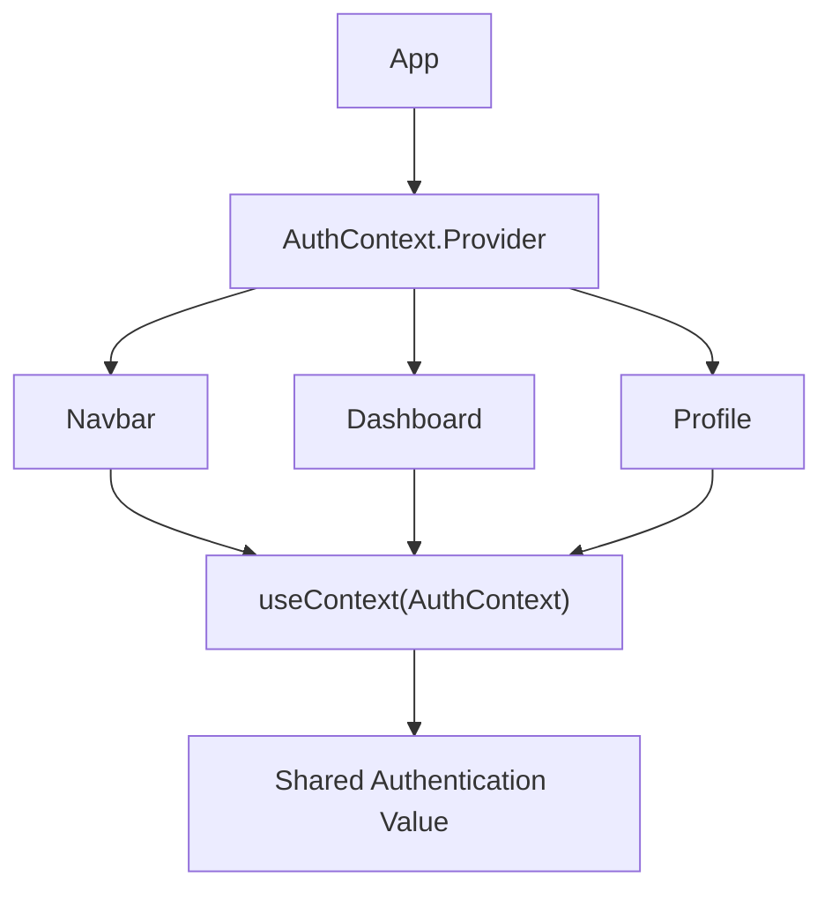

# ContextAPI Usage 

```mermaid

flowchart TD
    A["App"] --> B["AuthContext.Provider"]
    B --> C["Navbar"]
    B --> D["Dashboard"]
    B --> E["Profile"]
    C --> F["useContext(AuthContext)"]
    D --> F
    E --> F
    F --> G["Shared Authentication Value"]
```